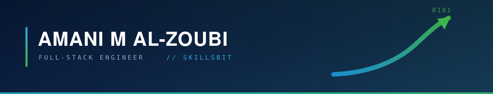

<div align="center">




<br/>

<a href="mailto:amani.alzoubi@outlook.com"></a>
<a href="https://www.linkedin.com/in/amani-m-al-zoubi-793635232/"></a>
<a href="https://www.skilsbit.com/"></a>


</div>

```
┌── CALIBRATION ────────────────────────────────────────────────────┐
│                                                                   │
│   ROLE        Full-stack engineer, backend-leaning                │
│   COMPANY     SkillsBIT · IT Solutions / Services / Academy       │
│   BASED       Amman, Jordan · remote across MENA and EU           │
│   CORE        Django · ASP.NET Core · React · Next.js · Postgres  │
│   SHIPPING    Vertical platforms: clinic, ERP, restaurant, EV     │
│   ORIGIN      BSc Electrical Engineering → RF systems → software  │
│                                                                   │
│   ● 1,920 contributions logged since Jul 2022                     │
│                                                                   │
└───────────────────────────────────────────────────────────────────┘
```

## ▸ About

I started in **electrical engineering**, analysing RF cavities and writing MATLAB simulations at SESAME, a particle accelerator in Jordan. Instrumentation teaches one habit above all others, and it is the one I still build software with: **measure, don't guess.** A system either behaves within tolerance or it does not, and opinions do not move the needle.

Today I build at **[SkillsBIT](https://www.skilsbit.com/)**, where we ship production platforms for entire business verticals: dental clinics, restaurants, ERP, EV charging, education. Front end and back end together, deployed per client rather than rebuilt from zero each time. My own work sits mainly on the backends, in Django and PostgreSQL.

Before that I spent a year as a teaching assistant at ASAC, mentoring bootcamp developers through their first production code. That year sharpened the part of engineering most people skip: being able to explain *why* the code works, not just that it does.

I care about REST APIs that are boring to consume, data models that survive the second feature request, and tests that fail for the right reason.

## ▸ Stack

<div align="center">

<sub><b>FRONTEND</b></sub><br/>


<sub><b>BACKEND &amp; LANGUAGES</b></sub><br/>


<sub><b>DATA &amp; DELIVERY</b></sub><br/>


</div>

**How I work** &nbsp;·&nbsp; test-driven development &nbsp;·&nbsp; REST API design &nbsp;·&nbsp; remote pair-programming &nbsp;·&nbsp; code review &nbsp;·&nbsp; mentoring junior developers

## ▸ At SkillsBIT

**[SkillsBIT](https://www.skilsbit.com/)** delivers IT solutions, services and an academy. On the product side we build vertical platforms: a complete front end and back end per industry, deployed per client with its own database and environment, so a business starts from a system that already runs and we fit it to the operation.

| Platform | What it covers | Stack |
| :--- | :--- | :--- |
| 🦷 **Dental clinic** | Public catalog, online booking, patient portal and staff admin panel, with a front end built around an interactive 3D treatment calculator. | `Django REST` `Next.js 15` `React 19` `TypeScript` `Tailwind v4` |
| 🏢 **ERP and HR** | Attendance, leave, employee profiles, documents and contracts, on a multi-tenant data model scoped per company. | `Django` `DRF` `PostgreSQL` |
| 🍽️ **Restaurant** | Menu, orders and day-to-day operations management. | `Django` `PostgreSQL` |
| 🔌 **EV charging** | Charging network platform: accounts, sites and charging sessions. | `Django` `PostgreSQL` |
| 🎓 **Education** | Student enrolment and registration, events and FAQ, plus a separate examination platform. | `Django` `DRF` |
| ⚙️ **Platform API** | The core SkillsBIT services API behind the product line. | `Django 5.2` `DRF 3.17` |

My own work concentrates on the **dental and ERP backends**, 314 commits across them this year. These repositories are private, though I am glad to walk through the architecture and the trade-offs in a call.

<div align="center">
<br/>
<a href="https://www.skilsbit.com/"></a>
</div>

## ▸ Selected projects

Team products I built and shipped as a working engineer, not tutorials.

<table>
<tr>
<td width="50%" valign="top">

### 🌙 Dhikraa
An Islamic companion app covering Ramadan countdown, prayer times, Athkar Al-Muslim, Quran recitations, task organisation and learning quizzes.

`Next.js` · `Django` · `PostgreSQL` · `Tailwind`

</td>
<td width="50%" valign="top">

### 📊 Twitter Story
A desktop analytics tool: profile insights, the top ten trends in Jordan and worldwide, hashtag and keyword search, tweet composing, and **sentiment analysis** across a user's timeline.

`Python` · `Tkinter` · `Pandas` · `NumPy` · `ML`

</td>
</tr>
<tr>
<td colspan="2" valign="top">

### 🏟️ World Cup 2022
A portal for the Qatar World Cup covering team profiles, match venues, hotel bookings near stadiums, fan comments and league news.

`React` · `Node.js` · `Express` · `MongoDB`

</td>
</tr>
</table>

## ▸ Signal

<div align="center">


<sub>Most of this work sits in private client repositories, so the trace is the honest signal.</sub>

</div>

## ▸ Trajectory

Four disciplines, one direction. Each one fed the next.

**`01`** &nbsp; **RF Engineer**, SESAME Synchrotron &nbsp;·&nbsp; *Jun 2021 → Jul 2022*
> Analysed RF cavities, wrote MATLAB and Python simulations to optimise system performance, and ran high-precision measurements on RF devices. Learned to trust instruments over intuition.

**`02`** &nbsp; **Teaching Assistant, Coding Program**, ASAC &nbsp;·&nbsp; *Mar 2023 → Mar 2024*
> Mentored bootcamp developers, debugged their code, shaped curriculum, and assessed progress through technical interviews. Teaching a thing is how you find out whether you know it.

**`03`** &nbsp; **AI Prompt Engineer**, MENADEVS &nbsp;·&nbsp; *Mar 2024 → Dec 2024*
> Designed and iterated prompts for generative models across several industries, running structured evaluations to reduce bias and make outputs reliable enough to ship.

**`04`** &nbsp; **BTEC IT Internal Verifier and Assessor**, ISO Education Schools &nbsp;·&nbsp; *Jan 2025 → Present*
> Verify assessment processes against BTEC and Pearson standards, review assessor decisions, and hold grading consistent across learner portfolios. Quality assurance, applied to people instead of code.

**Education**
`ASAC / Code Fellows` Full Stack Web Development, 900-hour intensive &nbsp;·&nbsp; 2022 to 2023
`University of Jordan` BSc Electrical Engineering &nbsp;·&nbsp; 2014 to 2019

## ▸ Contact

Open to full-time, remote and contract work. Email is the fastest way to reach me.

<div align="center">
<br/>

<a href="mailto:amani.alzoubi@outlook.com"></a>
<a href="https://www.linkedin.com/in/amani-m-al-zoubi-793635232/"></a>

<br/>

<sub><b>WORK WITH SKILLSBIT</b></sub><br/>

<a href="mailto:info@skilsbit.com"></a>
<a href="tel:+962785705454"></a>
<a href="https://www.skilsbit.com/"></a>

<br/><br/>

<sub><i>Measure, don't guess.</i></sub>


</div>
