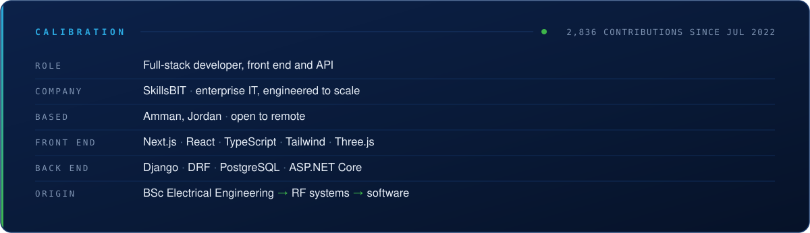
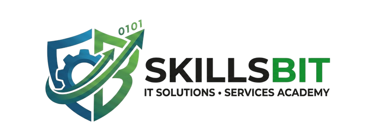

<picture>
  <source media="(max-width: 600px)" srcset="assets/header-narrow.svg" />
  
</picture>

<picture>
  <source media="(max-width: 600px)" srcset="assets/tagline-narrow.svg" />
  
</picture>

 

<picture>
  <source media="(max-width: 600px)" srcset="assets/calibration-narrow.svg" />
  
</picture>

## ▸ About

I build both ends of the same system. The SkillsBIT site runs on a Next.js front end and a Django REST API that I wrote and maintain. The dental platform is the same story: a React and TypeScript front end carrying an interactive 3D tooth model, sitting on a Django backend for booking, records and clinic administration. Working across the whole stack is the point, not a compromise.

**[SkillsBIT](https://www.skilsbit.com/)** builds, secures and scales the systems modern companies run on, then trains their people to own them. Founded in 2022 and based in Amman, the company works across infrastructure and cloud, software development, cybersecurity, data and AI, consulting and emerging technology, with an academy alongside it. My work sits on the software side: I design the data models, write the APIs and build the interfaces that go on top of them.

I came to software from **electrical engineering**. A BSc at the University of Jordan, then a year on radio frequency systems at the SESAME synchrotron, writing MATLAB and Python to simulate and tune RF performance. That work fixed one habit permanently: a system either behaves within tolerance or it does not, and no opinion changes the reading.

The route since has been deliberate rather than accidental. A 900-hour ASAC and Code Fellows programme in 2022, a year teaching it back as a teaching assistant, prompt design and evaluation at MENADEVS through 2024, then production Django and TypeScript from 2025. Each stack came from needing it, and the previous one never went to waste.

Concretely, that looks like multi-tenant data models scoped per company, append-only audit logging, several hundred automated tests running against PostgreSQL in CI, and deployments on Render, Vercel and Neon. I care about REST APIs that are dull to consume and data models that survive the second feature request.

## ▸ Stack

<picture>
  <source media="(max-width: 600px)" srcset="assets/stack-narrow.svg" />
  
</picture>

## ▸ At SkillsBIT

<a href="https://www.skilsbit.com/">
  <picture>
    <source media="(prefers-color-scheme: dark)" srcset="assets/logo-dark.png" />
    
  </picture>
</a>

SkillsBIT delivers enterprise IT across six practice areas and runs a bilingual academy alongside it. On the build side, systems are designed to be deployed per client, each with its own database and environment, so onboarding the next customer is configuration rather than a rewrite. A selection of what I have worked on:

<picture>
  <source media="(max-width: 600px)" srcset="assets/work-narrow.svg" />
  
</picture>

Most of this code is private. I am glad to screen-share it and talk through the trade-offs on a call.

 

## ▸ Signal

<picture>
  <source media="(max-width: 600px)" srcset="assets/signal-narrow.svg" />
  
</picture>

Rebuilt daily from the GitHub API. Most of the work behind it sits in private repositories, so this is the only public trace of it.

## ▸ Trajectory

<picture>
  <source media="(max-width: 600px)" srcset="assets/trajectory-narrow.svg" />
  
</picture>

## ▸ Contact

Open to full-time, remote and contract work. Email reaches me fastest and I answer.

 

 

<b>WORK WITH SKILLSBIT</b> 

  

<i>Measure, don't guess.</i>

